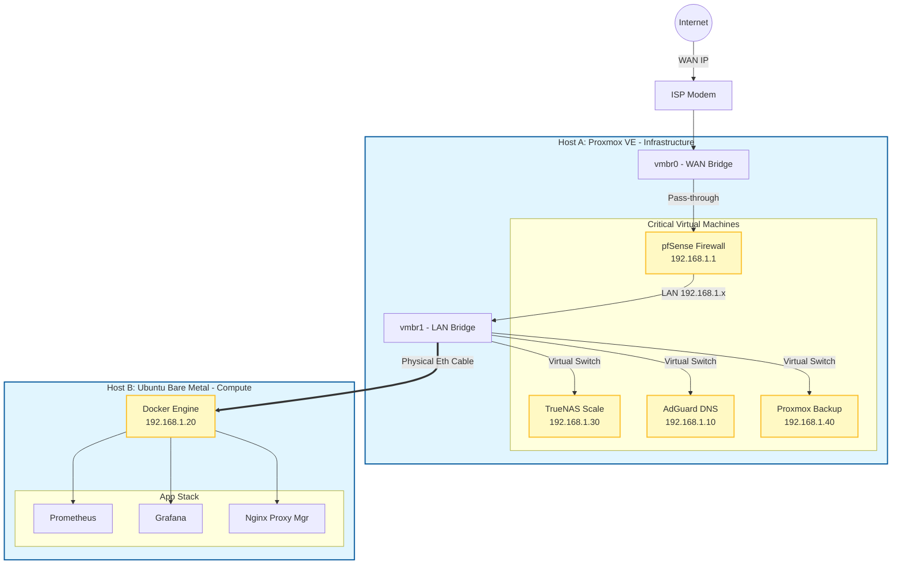

# Enterprise Hybrid Homelab Infrastructure


## Executive Summary
This project documents the design, implementation, and automation of a **Hybrid Enterprise Network**. Unlike standard virtualized labs, this architecture separates **Critical Infrastructure** (Virtual Routing/Storage) from **High-Performance Compute** (Bare Metal Docker Host) to eliminate single points of failure.

The environment simulates a modern **Zero-Trust (ZTNA)** network using SD-WAN overlays, containerized microservices, and full-stack observability.

---

## Architecture Topology


### 1. Physical & Virtual Infrastructure Layer
**Architecture Type:** Hybrid (Type-1 Hypervisor + Bare Metal)

| Node | Hardware | OS | Role |
| :--- | :--- | :--- | :--- |
| **Host A** | Dell OptiPlex 7070 | **Proxmox VE** | **Critical Infra:** Hosting Router, Storage, DNS, and Backup systems. |
| **Host B** | Physical PC | **Ubuntu Server 24.04** | **Compute:** Dedicated Docker Engine for high-performance application hosting. |

* **Engineering Decision:** Decoupling the "Compute" node from the "Router" node ensures that an application crash (OOM) on the Docker host does not take down the internet connection or DNS for the rest of the network.

### 2. Network Core: Routing & Zero Trust (SD-WAN)
**Technology:** pfSense Firewall (VM) + Tailscale
* **Segmentation:** Defined strict VLAN/Subnet separation (`192.168.1.0/24` LAN vs `10.0.0.x` ISP).
* **Zero Trust Access:** Implemented **Tailscale** directly on the firewall as a Subnet Router.
    * **Exit Node:** Routes remote traffic through the secure home ISP connection (Masking IP).
    * **No Port Forwarding:** Eliminated open WAN ports to reduce attack surface.

### 3. DNS Strategy & Traffic Control
**Technology:** AdGuard Home (LXC)
* **Split-Horizon DNS:** Configured DNS rewrites to map internal domains (`grafana.homelab.local`) to local IPs.
* **Global Filtering:** Integrated with Tailscale to enforce ad-blocking on mobile devices even when on cellular 5G networks.

### 4. Application Layer & Reverse Proxy
**Technology:** Docker, Nginx Proxy Manager (NPM), Portainer
* **Reverse Proxy:** Deployed NPM to handle HTTP traffic routing, enabling domain-name access (`http://app.homelab.local`) instead of IP:Port management.
* **Proxmox Proxying:** Configured Websocket support to proxy the Proxmox console securely through standard HTTPS ports.

### 5. Observability: The Monitoring Stack
**Technology:** Prometheus, Node Exporter, Grafana
* **Implementation:**
    * **Node Exporter:** Deployed with `--net=host` to scrape raw kernel metrics (CPU/RAM/Disk/Network I/O) from the bare metal host.
    * **Prometheus:** Scrapes metrics from `localhost:9100`.
    * **Grafana:** Visualizes data using Dashboard ID 1860 (Node Exporter Full).
* **Impact:** Provides "Single Pane of Glass" visibility for Capacity Planning and Site Reliability Engineering (SRE).

### 6. Storage & Disaster Recovery
**Technology:** TrueNAS Scale (VM) & Proxmox Backup Server (PBS)
* **Disk Passthrough:** Manually mapped physical disks to the VM via unique serial numbers to allow ZFS direct hardware access.
* **Data Integrity:** Configured ZFS Mirror (RAID-1) for bit-rot protection and redundancy.
* **Backup Strategy:** Automated nightly snapshots of all VMs to a dedicated Proxmox Backup Server instance.

### 7. Identity & Access Management (SSO)
**Technology:** Authentik
* **Goal:** Centralized Identity Provider (IdP) for Single Sign-On.
* **Integration:** Deployed the full stack (Server, Worker, Redis, Postgres) to replace individual local accounts with a unified authentication layer.

### 8. Infrastructure as Code (IaC)
**Technology:** Ansible
* **Inventory:** Hybrid inventory management (SSH for Ubuntu, Root for TrueNAS).
* **Security:** Used **Ansible Vault** to encrypt sensitive credentials in the repository.
* **Playbooks:**
    * `update_packages.yml`: Automated OS patching.
    * `deploy_monitoring.yml`: One-click deployment of the observability stack.

---
## How to Run
### 1. Prerequisite Setup
Ensure your control node (laptop/desktop) has **Ansible** and **Git** installed.
```bash
# Update and install Ansible (Ubuntu/Debian)
sudo apt update && sudo apt install -y ansible git
```

### 2. Clone the Repository
```bash
git clone [https://github.com/dannyhng/hybrid-homelab-infrastructure.git](https://github.com/dannyhng/hybrid-homelab-infrastructure.git)
cd hybrid-homelab-infrastructure
```

### 3. Infrastructure Automation (Ansible)
Update the inventory.ini file with your specific lab IP addresses if they differ from the defaults.
```bash
# -i points to the inventory file
# -K prompts for the sudo password (BECOME password)
ansible-playbook -i ansible/inventory/inventory.ini ansible/playbooks/site.yml -K
```

### 4. Deploy Application Stacks (Docker)
Deploy the Monitoring Stack (Prometheus/Grafana) and Reverse Proxy using Docker Compose.

**Deploy Monitoring:**
```bash
cd docker/monitoring
docker compose up -d
```

**Deploy Reverse Proxy:**
```bash
cd ../proxy
docker compose up -d
```
