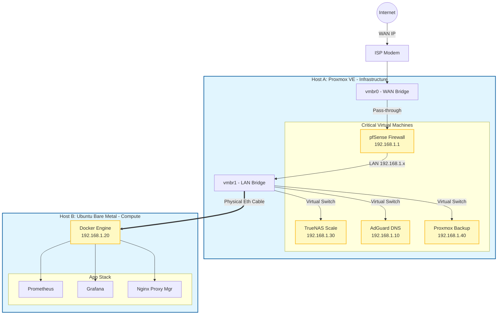

# Enterprise Hybrid Homelab Infrastructure


## Project Overview

This repository documents the architecture and automation of a hybrid network environment. The design separates **Critical Infrastructure** (Virtual Routing/Storage) from **Compute Resources** (Bare Metal Docker Host) to ensure network stability during high-load operations.

The environment utilizes a **Zero-Trust (ZTNA)** approach for remote access, replacing legacy port-forwarding with SD-WAN overlays.

---

## Architecture Topology

# System Architecture

### 1. Infrastructure Layer (Hybrid)

The lab utilizes a split-resource model to prevent compute exhaustion from impacting network routing.
* **Host A (Dell OptiPlex 7070):** Runs **Proxmox VE**. Hosts critical "always-on" services (Router, DNS, NAS).

* **Host B (Physical PC):** Runs **Ubuntu Server 24.04**. Dedicated bare-metal host for Docker containers.


### 2. Networking & Security

* **Edge Firewall:** pfSense acting as the primary gateway (`192.168.1.1`), managing VLANs and strictly separating lab traffic from the ISP network.

* **Remote Access:** Tailscale installed directly on pfSense as a Subnet Router. This allows secure access to internal IPs (`192.168.1.x`) without exposing ports to the WAN.

* **DNS:** AdGuard Home handles local DNS resolution (`app.homelab.local`) and network-wide content filtering.

### 3. Application & Proxy
* **Reverse Proxy**: Nginx Proxy Manager (NPM) handles SSL termination and routes traffic based on subdomains.

* **Proxmox Proxy:** Configured with Websocket support to allow secure access to the Proxmox console via standard HTTPS (443)

### 4. Observability Stack
Monitoring is deployed via Docker Compose on the bare-metal host.

  * **Node Exporter:** Configured with `--net=host` to scrape raw hardware metrics from the Ubuntu kernel.

  * **Prometheus:** Time-series database scraping targets at 15s intervals.

  * **Grafana:** Visualizes metrics using standard Linux Host dashboards (ID 1860).

### 5. Storage & Backups
* **TrueNAS Scale:** Virtualized with physical disk passthrough (via serial number mapping).

* **ZFS Mirror:** Two-disk mirror (RAID-1) configuration for data redundancy.

* **Backup:** Proxmox Backup Server (PBS) performs incremental nightly snapshots of all critical VMs.

### 6. Automation
Infrastructure management is handled via **Ansible**.
* **Inventory:** Defines connection methods for both physical (SSH) and virtual (API/Root) hosts.
* **Playbooks:**
    * `site.yml`: Routine system maintenance and package updates.
    * `deploy_monitoring.yml`: Automates the deployment of the Docker observability stack.
  
---
## How to Run
### 1. Prerequisite Setup
Ensure your control node (laptop/desktop) has **Ansible** and **Git** installed.
```bash
# Update and install Ansible (Ubuntu/Debian)
sudo apt update && sudo apt install -y ansible git
```

### 2. Clone the Repository
```bash
git clone [https://github.com/dannyhng/hybrid-homelab-infrastructure.git](https://github.com/dannyhng/hybrid-homelab-infrastructure.git)
cd hybrid-homelab-infrastructure
```

### 3. Run Automation (Ansible)
Edit `ansible/inventory/inventory.ini` to match your IP addresses, then run the maintenance playbook:
```bash
ansible-playbook -i ansible/inventory/inventory.ini ansible/playbooks/site.yml -K
```

### 4. Deploy Containers
Deploy the monitoring stack:
```bash
cd docker/monitoring
docker-compose up -d
```

