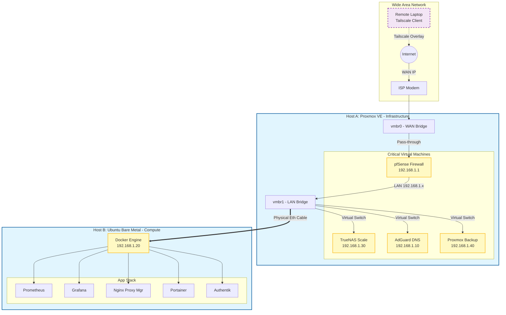

# Hybrid Homelab Infrastructure: From Manual Ops to Identity-Aware IaC


## Project Overview

This project represents months of iteration, troubleshooting, and rebuilding. What started as a simple desire to apply my CCNA studies evolved into a complex engineering challenge: building a network environment that functions like a production enterprise site, not just a sandbox.

Getting to this state wasn't a straight line. I spent weeks debugging broken routing tables, fixing YAML syntax errors in my automation scripts, and learning how to properly pass physical hardware through a hypervisor. There were plenty of moments where I broke the network and had to start over, but those failures taught me more about system interdependencies than any textbook could. This project bridged the gap between theory and practice for me. It forced me to think like an engineer: prioritizing uptime, security, and scalability.

Here is a detailed breakdown of the final architecture:

---

## Architecture Topology

# System Architecture

### Infrastructure Layer (Split-Topology)

To eliminate single points of failure and decouple network stability from application workloads, I architected a hybrid environment:
* **Virtualization Node (Proxmox VE):** Hosts critical "always-on" infrastructure (Routing, DNS, Storage). This ensures network uptime remains unaffected by high-load compute tasks.

* **Compute Node (Bare Metal Ubuntu 24.04):** A dedicated physical host optimized for Docker container orchestration. This separates the "Control Plane" from the "Data Plane."

### Networking & Security Strategy

* **Edge Security (pfSense):** Serves as the primary gateway managing VLAN segmentation to isolate Management, IoT, and Lab traffic.

* **Secure Remote Access (Tailscale):** Implemented a Mesh VPN with Subnet Routing directly on the edge firewall. This enables Zero Trust access to internal subnets (`192.168.1.0/24`) without exposing dangerous ports (SSH/HTTP) to the public WAN.

* **Split-Horizon DNS (AdGuard Home)** Centralized DNS resolution that provides internal domain mapping (`*.homelab.local`) and network-wide traffic filtering.

### Identity & Application Delivery

* **Traffic Management (Nginx Proxy Manager):** Acts as the ingress controller, handling Reverse Proxying, SSL termination, and routing traffic based on hostnames rather than IP addresses.
* **Centralized Identity (Authentik):** Deployed an Identity Provider (IdP) to enforce Single Sign-On (SSO) and MFA. This replaces disparate local credentials with a unified authentication layer for services like Portainer and Grafana.

### Observability & Monitoring
"You can't manage what you can't measure." I deployed a monitoring stack using Docker Compose on the bare-metal host.

  * **Metric Collection:** Utilized Prometheus with `node_exporter`. A key implementation detail was configuring the exporter with `--net=host`, allowing the containerized service to bypass network namespaces and scrape raw kernel metrics (CPU, I/O) from the bare-metal host.

  * **Visualization:** Integrated Grafana for real-time dashboarding of system health and container resource usage.

### Storage & Disaster Recovery

Storage was one of the hardest parts to get right. I wanted the flexibility of a VM but the data safety of ZFS.

* **Virtual NAS (TrueNAS Scale):** Configured with **Physical Disk Passthrough** to allow ZFS direct access to hardware controllers, ensuring data integrity features (Bitrot protection, COW) function correctly within a virtualized environment.

* **Disaster Recovery:** Automated nightly incremental backups via **Proxmox Backup Server (PBS)** for rapid state restoration.

---
# Engineering Challenges & Troubleshooting
### Challenge A: Physical Layer Legacy Configuration
**Symptom:** The Docker host failed to communicate with the router despite correct vSwitch configurations in Proxmox. **Root Cause:** The physical Cisco switch port retained an ACL and VLAN configuration from a previous deployment, silently dropping traffic. **Resolution:** Performed a console wipe of the switch configuration. This reinforced the troubleshooting methodology of verifying Layer 1 connectivity before debugging upper-layer software stacks.

### Challenge B: DNS Resolution Conflicts
**Symptom:** Internal domain resolution (`.local`) failed despite successful IP connectivity. **Root Cause:** A conflict between Ubuntu's `systemd-resolved`, the Tailscale daemon, and the AdGuard container all attempting to bind to Port 53. **Resolution:** Manually configured the Linux DNS priority order, forcing internal queries to the AdGuard resolver while allowing the host system to maintain upstream connectivity.

### Challenge C: PostgreSQL Database Deadlock (IAM Rollout)
**Symptom:** The Authentik initialization process hung indefinitely during the first deployment. **Root Cause:** A race condition occurred where the server and worker processes attempted to write to the PostgreSQL database simultaneously during the initial blueprint application, causing a transaction deadlock. **Resolution:** Diagnosed the lock via container logs and implemented a staggered restart sequence to clear the race condition, successfully initializing the IdP.

# Automation (Ansible)
To move away from manual "ClickOps," I implemented Ansible for configuration management.
* **Hybrid Inventory:** Manages connections to both SSH-based physical hosts and API-based virtual appliances.

* **Playbooks:**

    * `site.yml`: Automates system patching and package standardization across heterogeneous OS types (Debian/Ubuntu).

    * `deploy_stack.yml`: Orchestrates the deployment of the monitoring and proxy stacks using Docker Compose modules.
    
---
# How to Run
### Prerequisites
* Ansible 2.10+
* SSH Key-based access configured for target nodes.

### Deployment
#### 1. Clone the Repository:
```bash
git clone https://github.com/dannyhng/hybrid-homelab-infrastructure.git
```

#### 2. Configure Inventory:
Update `ansible/inventory/inventory.ini` with your specific IP addresses and user credentials.

#### 3. Execute Playbooks:
```bash
# Run system maintenance
ansible-playbook -i ansible/inventory/inventory.ini ansible/playbooks/site.yml
```


